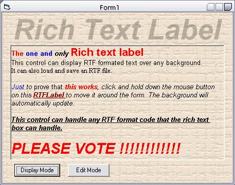



## Rich Text Label THAT WORKS

### Description

I created this because I am making a WYSIWYG editor and there is NOTHING on PSC that does this. I will admit there are some atempts but nothing I have seen comes close to this. Bascially this control BitBlts the form image under it into a picture box, then it BitBlts the rich text over it. VOTE PLEASE
 
### More Info
 
see readme.txt in zip file

             |
---                |---
**Submitted On**   |2002-05-09 19:28:28
**By**             |[Bryan A\. Cairns](https://github.com/Planet-Source-Code/PSCIndex/blob/master/ByAuthor/bryan-a-cairns.md)
**Level**          |Beginner
**User Rating**    |4.9 (127 globes from 26 users)
**Compatibility**  |VB 5\.0, VB 6\.0
**Category**       |[OLE/ COM/ DCOM/ Active\-X](https://github.com/Planet-Source-Code/PSCIndex/blob/master/ByCategory/ole-com-dcom-active-x__1-29.md)
**World**          |[Visual Basic](https://github.com/Planet-Source-Code/PSCIndex/blob/master/ByWorld/visual-basic.md)
**Archive File**   |[Rich\_Text\_81412592002\.zip](https://github.com/Planet-Source-Code/bryan-a-cairns-rich-text-label-that-works__1-34624/archive/master.zip)

